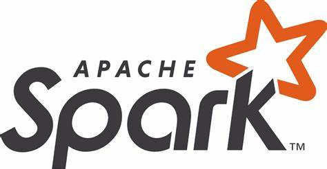

# Spark for data engineers

Spark for data engineers is repository that will provide readers overview, code samples and examples for better tackling Spark.




## Table of content / Featured blogposts 


1. [What is Apache Spark]() ([blogpost]()
2. [Getting started]() ([blogpost]())
3. [Basics about Spark language]() ([blogpost]())

 ## Blog

 All posts were originally posted on my [blog](https://tomaztsql.wordpress.com) and made copy here at Github. On Github is extremely simple to clone the code, markdown file and all the materials.

 ## Cloning the repository
 You can follow the steps below to clone the repository.

 ```
sudo git clone -n https://github.com/tomaztk/Spark-for-data-engineers.git
 ```

 ## Contact
 Get in contact:

  [](mailto:tomaztsql@gmail.com?subject=[GithubRepo]%20AzureDatabricks)

  [](https://github.com/tomaztk)

 <!--
 <a class="github-button" href="https://github.com/tomaztk" data-show-count="true" aria-label="Follow @tomaztk on GitHub">Follow @tomaztk</a>
 <script async defer src="https://buttons.github.io/buttons.js"></script>  -->


 ## Contributing
 Do the usual GitHub fork and pull request dance. Add yourself (or I will add you to the contributors section) if you want to. 


 ## Suggestions
 Feel free to suggest any new topics that you would like to be covered.

 ## Github.io
All code is available also at github site as a book markdown. [tomaztk.github.io](tomaztk.github.io)
Book is created using mdBook (with Rust and Cargo).

 ## License
 [MIT](https://choosealicense.com/licenses/mit/) © Tomaž Kaštrun